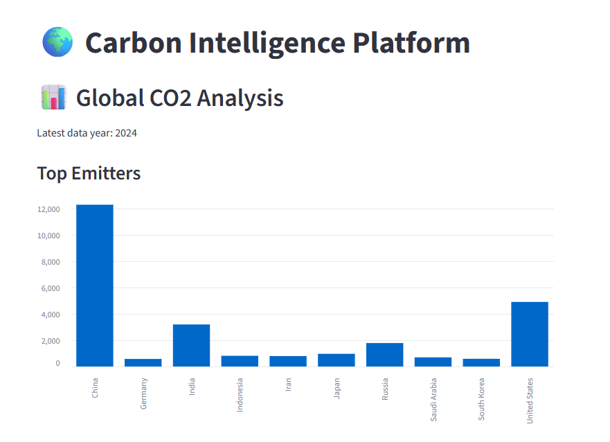
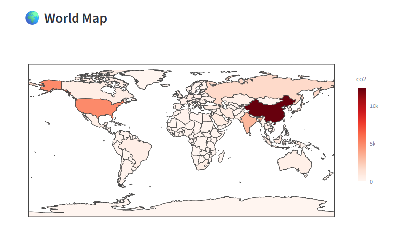
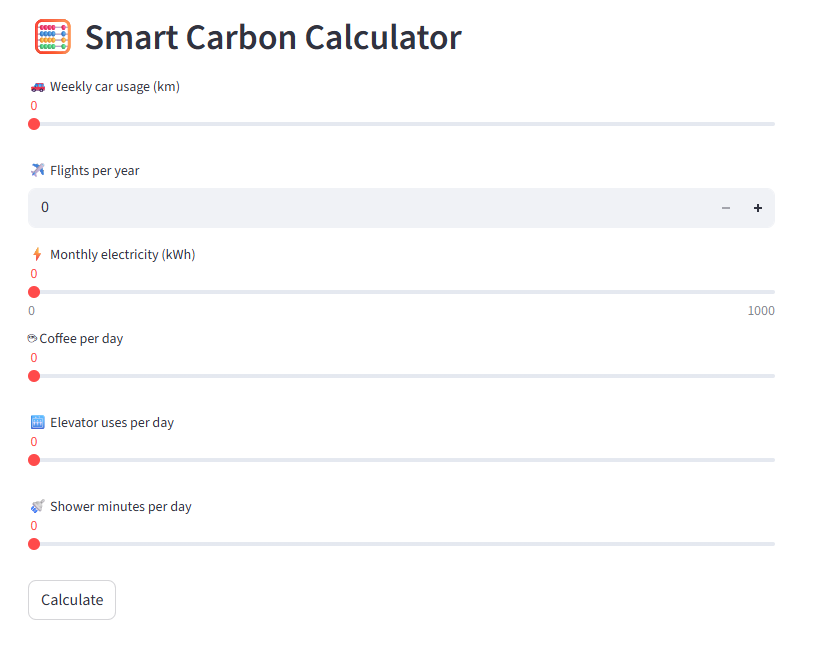
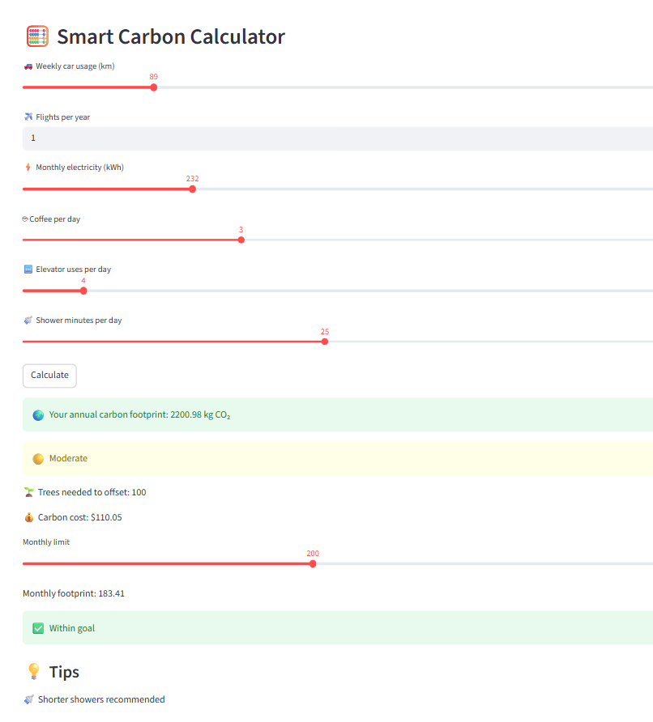
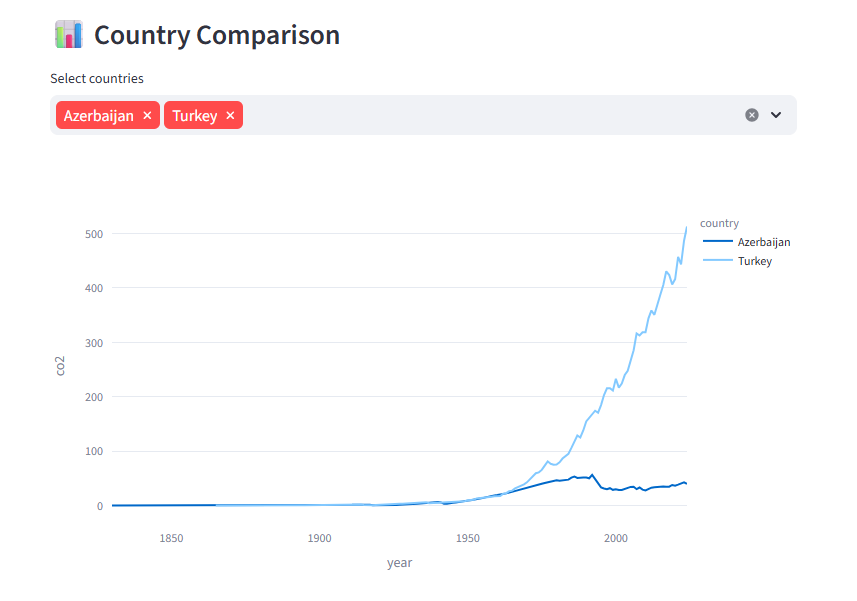

# 🌍 Carbon Intelligence Platform

### Climate Data Analytics & Personal Carbon Footprint Calculator


An end-to-end data analytics project that analyzes global CO₂ emissions and helps users understand their personal carbon footprint through interactive visualizations and machine learning.

---

## ✨ Key Highlights

-  Global CO₂ emissions dashboard
-  Interactive Plotly visualizations
-  Machine Learning prediction model
-  Personal carbon footprint calculator
-  Carbon offset estimation
-  Country comparison
-  Built with Python & Streamlit

## 📖 Project Overview

The Carbon Intelligence Platform is an interactive data analytics application developed using Python and Streamlit. It combines global CO₂ emissions data with personal carbon footprint calculations to raise awareness about climate change and promote sustainable decision-making.

The project includes:

- Global CO₂ emissions analysis
- Interactive dashboards
- Country comparison
- Personal carbon footprint calculator
- Carbon offset estimation
- Machine Learning prediction model

---

## 🚀 Features

✅ Interactive Dashboard

- Global CO₂ emissions visualization
- Country-level filtering
- Historical trend analysis

✅ Carbon Footprint Calculator

Calculate emissions from:

-  Car travel
-  Flights
-  Electricity consumption
-  Coffee consumption
-  Daily activities

✅ Country Comparison

Compare:

- Total CO₂ emissions
- CO₂ per capita
- CO₂ per GDP
- Historical trends

✅ Machine Learning

- Polynomial Regression model
- CO₂ emission prediction
- Future trend estimation

---

## 📊 Dataset

Source:

**Our World in Data (OWID) CO₂ Dataset**

The dataset contains:

- Annual CO₂ emissions
- Population
- GDP
- CO₂ per capita
- CO₂ per GDP
- Energy consumption
- Historical climate indicators

---

## 🛠 Technologies Used

- Python
- Streamlit
- Pandas
- NumPy
- Plotly
- Matplotlib
- Scikit-learn

---

## 📂 Project Structure

```
carbon-intelligence-platform
│
├── app.py
├── owid-co2-data.csv
├── requirements.txt
├── README.md
├── final project.docx
└── images/
```

---

## ⚙ Installation

Clone the repository

```bash
git clone https://github.com/faridaallahverdi-579/carbon-intelligence-platform.git
```

Move into the project

```bash
cd carbon-intelligence-platform
```

Install dependencies

```bash
pip install -r requirements.txt
```

Run the application

```bash
streamlit run app.py
```

---

## 📈 Machine Learning

The project includes a Polynomial Regression model to predict future CO₂ emissions based on historical environmental data.

Workflow:

- Data Cleaning
- Feature Engineering
- Exploratory Data Analysis (EDA)
- Model Training
- Model Evaluation
- Prediction

---

## 💼 Skills Demonstrated

- Data Cleaning
- Exploratory Data Analysis
- Data Visualization
- Dashboard Development
- Machine Learning
- Streamlit Application Development
- Python Programming
- Data Storytelling

## 🌱 Environmental Impact

The platform helps users:

- Understand their carbon footprint
- Compare emissions across countries
- Learn sustainable lifestyle habits
- Estimate the number of trees required to offset emissions

---

## 📸 Screenshots

The following screenshots demonstrate the key features of the **Carbon Intelligence Platform**.

### 🌍 Global CO₂ Analysis Dashboard

The main dashboard provides an overview of global CO₂ emissions, interactive charts, and key environmental indicators.



---

### 🗺️ Interactive World CO₂ Map

An interactive world map that allows users to explore CO₂ emissions by country.



---

### 🌱 Smart Carbon Calculator (Default View)

The default interface of the Smart Carbon Calculator before entering user data.



---

### 🌱 Smart Carbon Calculator (Calculated Results)

The calculator estimates a user's carbon footprint based on lifestyle activities and provides personalized environmental insights.



---

### 📊 Country Comparison

Compare CO₂ emissions, emissions per capita, and historical trends between multiple countries using interactive visualizations.




### Machine Learning Prediction


Example:

- Home Dashboard
- World CO₂ Map
- Carbon Calculator
- Country Comparison
- Prediction Dashboard

---

## 🎯 Future Improvements

- AI-powered sustainability recommendations
- Real-time environmental data
- Mobile-friendly interface
- User authentication
- Cloud deployment

---

## 👩‍💻 Author

**Farida Allahverdiyeva**

Data Analytics | Python | Power BI | SQL | Machine Learning

GitHub:
https://github.com/faridaallahverdi-579

LinkedIn:
https://www.linkedin.com/in/farida-allahverdiyeva-05675072/

---

## 📄 License

This project is developed for educational and portfolio purposes.
